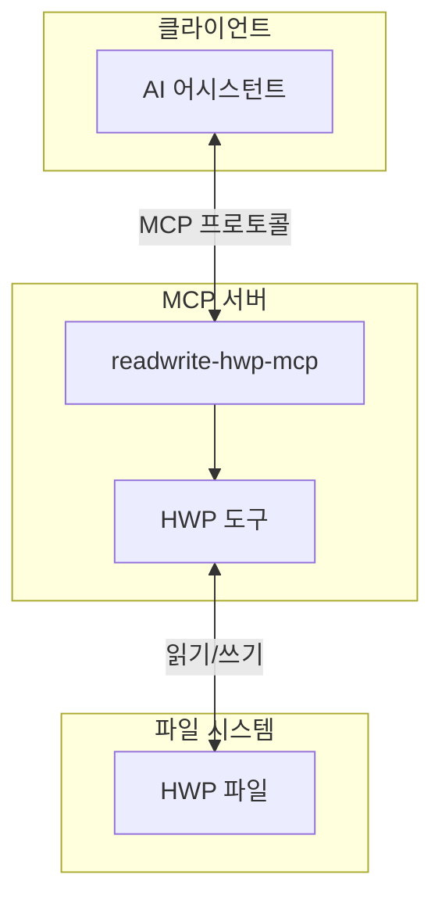

# 시스템 개요

## 아키텍처

readwrite-hwp-mcp는 MCP(Model Context Protocol) 서버로, AI 어시스턴트가 한글(HWP) 파일을 읽고 쓸 수 있도록 합니다.

## 컴포넌트

| 컴포넌트 | 역할 |
|---------|------|
| MCP 서버 | MCP 프로토콜 처리 및 도구 제공 |
| HWP 도구 | HWP 파일 읽기/쓰기 기능 |

## 데이터 흐름

1. AI 어시스턴트가 MCP 프로토콜로 도구 호출
2. MCP 서버가 요청을 HWP 도구로 전달
3. HWP 도구가 파일 시스템에서 HWP 파일 처리
4. 결과를 AI 어시스턴트에게 반환
