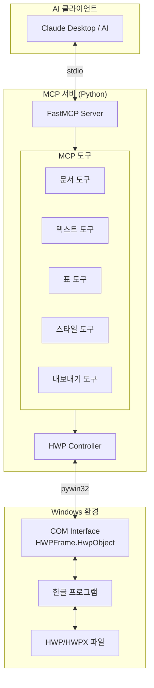

# HWP MCP 서버 기획서

> 작성일: 2026-02-03
> 버전: 1.0

## 1. 프로젝트 개요

### 1.1 목표
Windows 환경에서 한글(HWP) 프로그램의 COM 인터페이스를 활용하여 HWP/HWPX 문서를 완벽하게 제어할 수 있는 MCP(Model Context Protocol) 서버 개발

### 1.2 핵심 결정사항

| 항목 | 선택 | 이유 |
|------|------|------|
| 플랫폼 | Windows 전용 | COM 인터페이스로 완벽한 호환성 확보 |
| 기술 스택 | Python | pywin32로 COM 연동 용이, 검증된 방식 |
| 파일 포맷 | HWP + HWPX | 바이너리/XML 모두 지원 |
| 한글 프로그램 | 필수 (2010 이상) | HWPFrame.HwpObject COM 객체 사용 |

### 1.3 참고 프로젝트

| 프로젝트 | URL | 특징 |
|----------|-----|------|
| jkf87/hwp-mcp | https://github.com/jkf87/hwp-mcp | 기본 기능, 테이블 처리 |
| skerishKang/33MCP_HWP_Limone | https://github.com/skerishKang/33MCP_HWP_Limone | 59개 도구, FastMCP |

---

## 2. 기술 스택

### 2.1 필수 요구사항

```
- Windows 10/11
- 한글 2010 이상 (HWPFrame.HwpObject 지원)
- Python 3.10+
- pywin32
```

### 2.2 의존성 패키지

```python
# requirements.txt
mcp>=1.0.0          # MCP SDK (또는 fastmcp)
pywin32>=306        # Windows COM 인터페이스
pydantic>=2.0       # 데이터 검증
python-dotenv       # 환경 설정
```

### 2.3 MCP 프레임워크 선택

**FastMCP 권장** (기존 프로젝트들이 사용)
- 간결한 데코레이터 기반 API
- 자동 스키마 생성
- 에러 핸들링 내장

---

## 3. 프로젝트 구조

```
readwrite-hwp-mcp/
├── src/
│   ├── __init__.py
│   ├── server.py              # MCP 서버 메인 (FastMCP)
│   │
│   ├── hwp/                   # HWP 제어 모듈
│   │   ├── __init__.py
│   │   ├── controller.py      # HWP COM 컨트롤러 (핵심)
│   │   ├── constants.py       # HWP 액션/파라미터 상수
│   │   └── exceptions.py      # 커스텀 예외
│   │
│   ├── tools/                 # MCP 도구 모듈
│   │   ├── __init__.py
│   │   ├── document.py        # 문서 관리 도구
│   │   ├── text.py            # 텍스트 편집 도구
│   │   ├── table.py           # 표 조작 도구
│   │   ├── style.py           # 서식/스타일 도구
│   │   ├── image.py           # 이미지 도구
│   │   ├── page.py            # 페이지 설정 도구
│   │   └── export.py          # 내보내기 도구 (PDF 등)
│   │
│   └── utils/                 # 유틸리티
│       ├── __init__.py
│       ├── path_utils.py      # 경로 처리
│       └── validation.py      # 입력 검증
│
├── tests/                     # 테스트
│   ├── test_controller.py
│   ├── test_tools.py
│   └── fixtures/              # 테스트용 HWP 파일
│
├── docs/                      # 문서
├── examples/                  # 사용 예제
│
├── requirements.txt
├── pyproject.toml
├── README.md
└── .env.example
```

---

## 4. 아키텍처 설계

### 4.1 시스템 아키텍처



### 4.2 HWP Controller 핵심 구조

```python
# src/hwp/controller.py (설계)
class HwpController:
    """한글 COM 인터페이스 컨트롤러"""

    def __init__(self):
        self.hwp = None  # COM 객체

    def connect(self) -> bool:
        """한글 프로그램 연결"""
        # win32com.client.Dispatch("HWPFrame.HwpObject")

    def disconnect(self) -> None:
        """연결 해제"""

    # 문서 관리
    def create_document(self) -> bool
    def open_document(self, path: str) -> bool
    def save_document(self, path: str = None) -> bool
    def close_document(self) -> bool

    # 텍스트 편집
    def insert_text(self, text: str) -> bool
    def get_text(self) -> str
    def find_replace(self, find: str, replace: str) -> int

    # 표 조작
    def create_table(self, rows: int, cols: int) -> bool
    def set_cell(self, row: int, col: int, text: str) -> bool
    def get_cell(self, row: int, col: int) -> str

    # 서식
    def set_font(self, name: str, size: int, bold: bool = False) -> bool
    def set_paragraph_align(self, align: str) -> bool

    # 내보내기
    def export_pdf(self, path: str) -> bool

    # HWP 액션 실행 (저수준)
    def run_action(self, action: str, params: dict = None) -> any
```

### 4.3 COM 연결 방식

```python
import win32com.client

# 방법 1: 새 인스턴스 생성
hwp = win32com.client.Dispatch("HWPFrame.HwpObject")

# 방법 2: 실행 중인 한글에 연결
hwp = win32com.client.GetActiveObject("HWPFrame.HwpObject")

# 보안 모듈 등록 (외부 파일 접근 허용)
hwp.RegisterModule("FilePathCheckerModule", "보안모듈")
```

---

## 5. MCP 도구 목록

### 5.1 1단계: MVP (20개 도구)

#### 문서 관리 (6개)
| 도구명 | 설명 | 우선순위 |
|--------|------|----------|
| `hwp_connect` | 한글 프로그램 연결 | P0 |
| `hwp_create` | 새 문서 생성 | P0 |
| `hwp_open` | 기존 문서 열기 | P0 |
| `hwp_save` | 문서 저장 | P0 |
| `hwp_save_as` | 다른 이름으로 저장 | P0 |
| `hwp_close` | 문서 닫기 | P0 |

#### 텍스트 편집 (6개)
| 도구명 | 설명 | 우선순위 |
|--------|------|----------|
| `hwp_insert_text` | 텍스트 삽입 | P0 |
| `hwp_get_text` | 전체 텍스트 추출 | P0 |
| `hwp_find_text` | 텍스트 검색 | P1 |
| `hwp_replace_text` | 텍스트 치환 | P1 |
| `hwp_insert_paragraph` | 단락 삽입 | P1 |
| `hwp_move_cursor` | 커서 이동 | P1 |

#### 표 조작 (5개)
| 도구명 | 설명 | 우선순위 |
|--------|------|----------|
| `hwp_create_table` | 표 생성 | P0 |
| `hwp_get_cell` | 셀 내용 조회 | P0 |
| `hwp_set_cell` | 셀 내용 설정 | P0 |
| `hwp_insert_row` | 행 추가 | P1 |
| `hwp_delete_row` | 행 삭제 | P1 |

#### 서식 (3개)
| 도구명 | 설명 | 우선순위 |
|--------|------|----------|
| `hwp_set_font` | 글꼴 설정 | P1 |
| `hwp_set_align` | 정렬 설정 | P1 |
| `hwp_set_style` | 스타일 적용 | P1 |

### 5.2 2단계: 확장 (15개 도구)

#### 표 확장
- `hwp_insert_column` - 열 추가
- `hwp_delete_column` - 열 삭제
- `hwp_merge_cells` - 셀 병합
- `hwp_split_cell` - 셀 분할
- `hwp_set_table_border` - 표 테두리 설정

#### 이미지/도형
- `hwp_insert_image` - 이미지 삽입
- `hwp_insert_shape` - 도형 삽입
- `hwp_resize_image` - 이미지 크기 조정

#### 페이지 설정
- `hwp_set_page_size` - 용지 크기
- `hwp_set_margins` - 여백 설정
- `hwp_insert_page_break` - 페이지 나누기
- `hwp_set_header` - 머리말 설정
- `hwp_set_footer` - 꼬리말 설정

#### 내보내기
- `hwp_export_pdf` - PDF 내보내기
- `hwp_export_text` - 텍스트 내보내기

### 5.3 3단계: 고급 (10개+ 도구)

- `hwp_batch_operations` - 일괄 작업 실행
- `hwp_run_action` - HWP 액션 직접 실행
- `hwp_insert_field` - 필드 삽입 (누름틀 등)
- `hwp_fill_field` - 필드 값 채우기
- `hwp_insert_footnote` - 각주 삽입
- `hwp_insert_hyperlink` - 하이퍼링크 삽입
- `hwp_protect_document` - 문서 보호
- `hwp_insert_toc` - 목차 삽입
- `hwp_mail_merge` - 메일 머지
- `hwp_get_document_info` - 문서 정보 조회

---

## 6. 구현 로드맵

### 6.1 Phase 1: MVP (2-3주)

#### Week 1: 기반 구축
- [ ] 프로젝트 초기화 (pyproject.toml, requirements.txt)
- [ ] HwpController 기본 구현 (connect, disconnect)
- [ ] FastMCP 서버 설정
- [ ] 문서 관리 도구 6개 구현

#### Week 2: 핵심 기능
- [ ] 텍스트 편집 도구 6개 구현
- [ ] 표 기본 도구 5개 구현
- [ ] 기본 서식 도구 3개 구현

#### Week 3: 안정화
- [ ] 에러 핸들링 강화
- [ ] 테스트 작성
- [ ] 문서화 및 예제

### 6.2 Phase 2: 확장 (2주)
- 표 확장 도구
- 이미지/도형 도구
- 페이지 설정 도구
- 내보내기 도구

### 6.3 Phase 3: 고급 (2주)
- 일괄 작업
- 필드/누름틀
- 메일 머지
- 고급 기능

---

## 7. 설정 및 배포

### 7.1 Claude Desktop 설정

```json
{
  "mcpServers": {
    "hwp": {
      "command": "python",
      "args": ["-m", "src.server"],
      "cwd": "C:\\path\\to\\readwrite-hwp-mcp"
    }
  }
}
```

또는 uv 사용 시:
```json
{
  "mcpServers": {
    "hwp": {
      "command": "uv",
      "args": ["run", "python", "-m", "src.server"],
      "cwd": "C:\\path\\to\\readwrite-hwp-mcp"
    }
  }
}
```

---

## 8. 제약사항 및 주의사항

### 8.1 시스템 요구사항
- Windows 전용 (macOS, Linux 미지원)
- 한글 2010 이상 설치 필수
- 한글 프로그램이 실행 중이어야 함 (또는 자동 실행)

### 8.2 보안 고려사항
- 외부 파일 접근 시 보안 모듈 등록 필요
- `RegisterModule` API 사용하여 보안 경고 우회
- 파일 경로 검증으로 악의적 접근 방지

### 8.3 동시성 제한
- 한글 COM은 단일 스레드 아파트(STA) 모델
- 동시에 여러 문서 조작 시 주의 필요
- 필요시 문서별 큐 또는 락 구현

### 8.4 한글 버전 호환성
- HWP 2010: 기본 COM 지원
- HWP 2014+: 추가 액션/기능
- HWP 2020+: 최신 기능

---

## 9. 검증 계획

### 9.1 테스트 시나리오

1. **기본 흐름**
   - 한글 연결 → 새 문서 → 텍스트 입력 → 저장 → 닫기

2. **표 작업**
   - 표 생성 → 데이터 입력 → 행/열 추가 → 셀 병합

3. **서식 적용**
   - 텍스트 선택 → 글꼴 변경 → 정렬 변경

4. **내보내기**
   - 문서 열기 → PDF 내보내기 → 파일 확인

### 9.2 MCP Inspector 테스트
- MCP Inspector로 각 도구 개별 테스트
- 파라미터 검증
- 에러 응답 확인

---

## 10. 참고 자료

### 공식 문서
- [한글 오토메이션 API](https://www.hancom.com/etc/hwpDownload.do)
- [MCP Python SDK](https://github.com/modelcontextprotocol/python-sdk)
- [FastMCP](https://github.com/jlowin/fastmcp)

### 참고 코드
- [jkf87/hwp-mcp](https://github.com/jkf87/hwp-mcp) - hwp_controller.py 참고
- [skerishKang/33MCP_HWP_Limone](https://github.com/skerishKang/33MCP_HWP_Limone) - 고급 기능 참고

### HWP 액션 레퍼런스
- HWP 액션은 `HAction.Run("ActionName", ParameterSet)` 형태로 호출
- 주요 액션: MoveDocBegin, MoveDocEnd, InsertText, CreateTable 등
